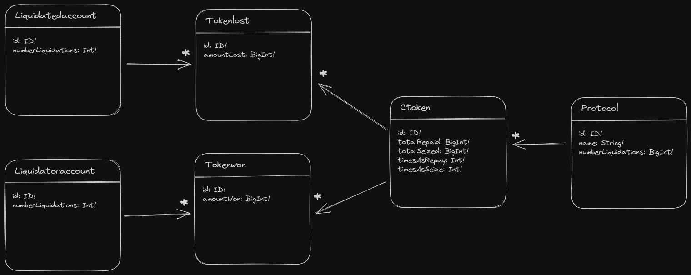

## Envio Blank Template

*Please refer to the [documentation website](https://docs.envio.dev) for a thorough guide on all Envio indexer features*

 *When cloning the repo for the first time run `envio codegen` to generate the indexing files in the generated folder

# Simple database diagram

Protocols to index
[x] Compound V2 (eth mainnnet - 1)
[x] Venus (BNB - 56)
[ ] Benqui Lending (Avalanche - 43114)
[x] Sonne Finance (Optimism - 10)